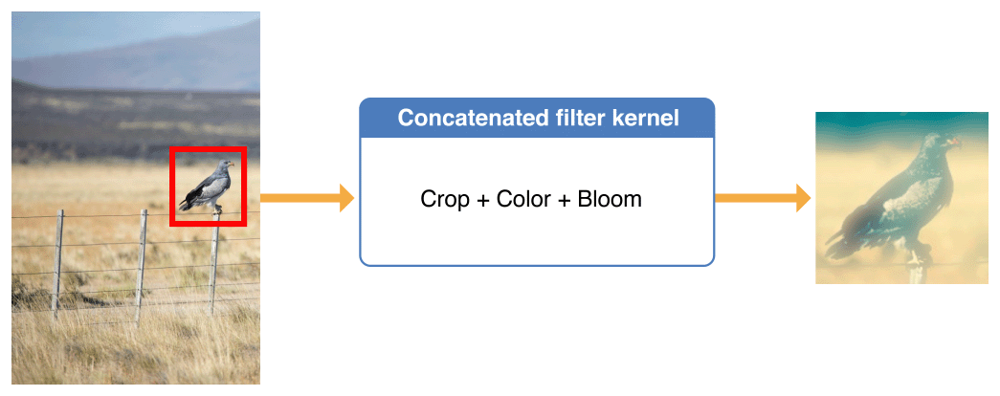
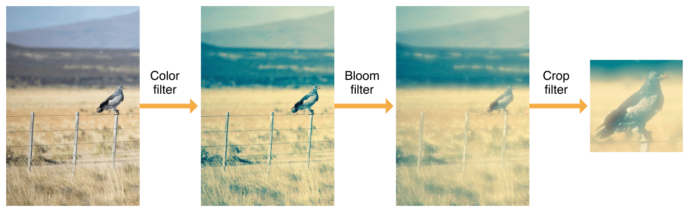
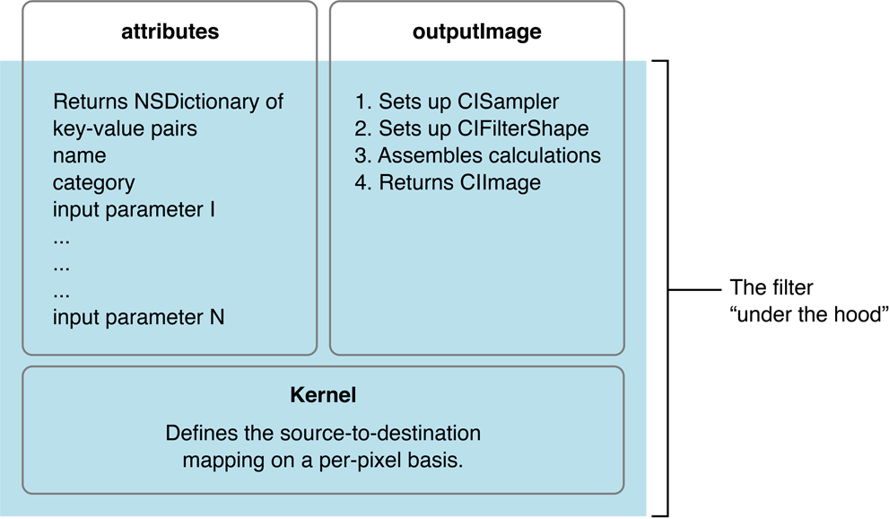
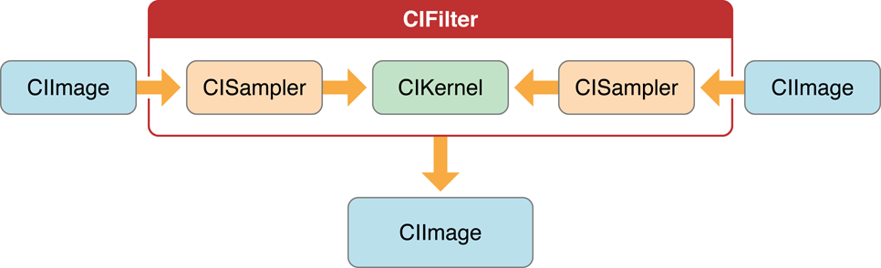

# Core Image + CI Filters

## Guidelines

- Fast image processing and analysis

- What to look at:

  Automatic Enhancements, CIDetector

  

## Ideas

- Program with which you can set all filters for your own photos and make face detection or object detection.
  - Load/Save Image to album
  - Only filter which create an output image
  - Small preview for each filter in the selection
  - Example for a chained filter
  - Example for a custom filter (max basic)
  - SwiftUI
  - Outsource code into different files
    - Only what we want to present in a file
  - Code Documentation
    - Understanding each function call
- Quartz Composer

<figure>
  
  <figcaption>Figure: Quartz Composer example<br>
      Source: <a href="https://www.objc.io/images/issue-21/quartz_c4a7e45.png">https://www.objc.io/images/issue-21/quartz_c4a7e45.png</a></figcaption>
</figure>


## General

### Core Image

- Built-in Filters
- Feature detection
- Automatic image enhancement
- Chain multiple filters together 
- Highly hardware optimized image processing
- Can achieve real-time performance for still and video images
- No need for understanding the details of OpenGL and Metal to use the technology.

### Different Image Classes

- UIImage
  - Class of the UIKit framework
  - High Level Way to display image data
  - Specified length and position in the "point" units
  - Mainly used to interact with the view
- Image
  - ToDo SwiftUI
- CIImage
  - Class of CoreImage framework.
  - Is not a picture itself but has all the information to create a picture
  - Is used to apply filters with Core Image
- CGImage
  - Class of CoreGraphics framework.
  - Can only represent bitmaps
  - Specifying the length and position in the "pixel" unit
  - Is used to apply blend modes and masking

### Context

- Core Image requires a Context in which the computing is done
- Allocates the necessary memory
- Compiling and running the filter kernels
- Very expensive to create

### Filter

- A filter creates a transformation of an image with set values


## Processing Images

### Loading/saving Images

### Filtering an Image

1. Create and customize a filter chain
2. Pass an image to be filtered
3. Get the completely filtered image

<figure>
  
  <figcaption>Figure: Core Image pipeline<br>
      Source: <a href="https://developer.apple.com/library/archive/documentation/GraphicsImaging/Conceptual/CoreImaging/art/architecture_2x.png">https://developer.apple.com/library/archive/documentation/GraphicsImaging/Conceptual/CoreImaging/art/architecture_2x.png</a></figcaption>
</figure>

ToDo: Recreate that image or own example

#### Creating an input image

#### We need a CIImage and  for example it can be easily created with a UIImage.

```swift
let cgInputImage = CIImage(image: uiImageInput)
```

#### Passing the Image to the filter

```swift
sepiaFilter.setValue(cgInputImage, forKey: kCIInputImageKey)
```

#### Convert the resulting CIImage back to a UIImage

```swift
let uiOutputImage = UIImage(cgImage: cgOutputImage)
```


## Built-in Filters

### Display a list of all available filters

```swift
let buildInFilters = CIFilter.filterNames(inCategory: kCICategoryBuiltIn)
print(buildInFilters)
```

- 230 on iPadOS 15.1

### Initialize a CIFilter

```swift
let sepiaFilter = CIFilter(name: "CISepiaTone")
```

### Customize  Built-in Filters Parameters

- Most properties are accessible via a key-value coding (KVC)
- Display a list of all available input keys

```swift
let allSepiaInputKeys = sepiaFilter.inputKeys
print(allSepiaInputKeys)
```

- If you want to display more detailed information for each parameter, such as an explanation, the min/max/default value and more
  - It is a "build-in" reference documentation for it's filters

```swift
let allSepiaAttributes = sepiaFilter.attributes
print(allSepiaAttributes)
```

- With the right key you can set a value as follows:

```swift
sepiaFilter.setValue(1.0, forKey: kCIInputIntensityKey)
```

- Unfortunately, the parameters are not type-safe and must therefore be set very carefully.

### Chainging Filters together

- Filters can be chained in a row, since the output of the first filter can become the input of the second.
  - Core Image combines chained filters intelligently so that they are calculated more efficiently.
  - Core image defers the work until the finished image is requested
- A compound effect filter can be included in a subclass of CIFilter for easy reuse.
- Apple calls it "recipe"

<figure>
  
  <figcaption>Figure: Example "recipe"<br>
      Source: <a href="https://developer.apple.com/library/archive/documentation/GraphicsImaging/Conceptual/CoreImaging/art/filter_chain02_2x.png">https://developer.apple.com/library/archive/documentation/GraphicsImaging/Conceptual/CoreImaging/art/filter_chain02_2x.png</a></figcaption>
</figure>

<figure>
  
  <figcaption>Figure: Chained filters<br>
      Source: <a href="https://developer.apple.com/library/archive/documentation/GraphicsImaging/Conceptual/CoreImaging/art/filter_chain01_2x.png">https://developer.apple.com/library/archive/documentation/GraphicsImaging/Conceptual/CoreImaging/art/filter_chain01_2x.png</a></figcaption>
</figure>

## Performance

ToDo: Testen

- When is cpu used?
- When is gpu used?
- Expenses to create a CIContext


- Whenever possible, Core Image will perform filtering on the GPU.
  - We can force Core Image to use the CPU with ``kCIContextUseSoftwareRenderer = true``
- In Xcode you can write diagnostic information for filtering to the console with the option CI_PRINT_TREE = 1 

### Performance Best Practices

- Do not always create a new CIContext 
  - Contexts store a lot of state information; it’s more efficient to reuse them.
- Use smaller images when possible


## Detecting Faces/ Objects in an Image

- Detect human face features
  - Eye and mouth positions
  - Multiple faces possible
  - Performs face detection, not recognition
- Rectangles
- QRCode
- Text

<figure>
  
  <figcaption>Figure: Detecting Objects in Still Images<br>
      Source: <a href="https://docs-assets.developer.apple.com/published/a276deb100/rendered2x-1584571993.png">https://docs-assets.developer.apple.com/published/a276deb100/rendered2x-1584571993.png</a></figcaption>
</figure>

ToDo: Recreate that image or own example

## Auto Enhancing Images

- Core Image can analyze the quality of an image

- It provide a set of filters with optimal settings for adjusting for example

  - Hue
  - Contrast
  - Tone color
  - Analyzes an image for its histogram
  - Correcting for flash artifacts such as red eye

- Is returns an array of CIFilters with preset parameter values

- Filters that Core Image uses to enhance an image

  | Filter                  | Purpose                                                      |
  | :---------------------- | :----------------------------------------------------------- |
  | CIRedEyeCorrection      | Repairs red/amber/white eye due to camera flash              |
  | CIFaceBalance           | Adjusts the color of a face to give pleasing skin tones      |
  | CIVibrance              | Increases the saturation of an image without distorting the skin tones |
  | CIToneCurve             | Adjusts image contrast                                       |
  | CIHighlightShadowAdjust | Adjusts shadow details                                       |

- You only have to call one function 

   ``autoAdjustmentFilters`` or ``autoAdjustmentFiltersWithOptions``

  In the options you can set the image orientation and whether you want to remove red eyes or not.

  


## Creating Custom Filters

- Core Image provides Support for custom filters
- Apple differentiates between Filter Clients and Filter Creators
  - Filter Clients
    - Only use the filters
    - Only see the inputs and outputs.
    - Are able to set the parameters of the inputs
    - The methods attributes and outputImage are provided for the Filter Client

A filter client does not see the blue area, a filter creator has to specify it

<figure>
  
  <figcaption>Figure: The components of a typical filter<br>
      Source: <a href="https://developer.apple.com/library/archive/documentation/GraphicsImaging/Conceptual/CoreImaging/art/filter_anatomy_2x.png">https://developer.apple.com/library/archive/documentation/GraphicsImaging/Conceptual/CoreImaging/art/filter_anatomy_2x.png</a></figcaption>
</figure>

- Filter Creators

  - Sampler

    - Fetch pixels from sources
  - provides the data to the kernel.
  
- Kernel
  
  - Processes the pixels
  
  - In the kernel you can specify how the Filter calculates the pixel for the resulting image
  
    - A kernel is a convolution matrix or mask which can be applied to an image.
  
    - For example:
  
      ​    Identity:				  Edge detection:
  
      $\begin{bmatrix}0&0&0\\0&1&0\\0&0&0\end{bmatrix}$            $\begin{bmatrix}0&-1&0\\-1&4&-1\\0&-1&0\end{bmatrix}$
  
    - The kernel is written in a subset of GLSL, the OpenGL Shading LanguageL (glslang)

<figure>
  
  <figcaption>Figure: The pixel processing path<br>
      Source: <a href="https://developer.apple.com/library/archive/documentation/GraphicsImaging/Conceptual/CoreImaging/art/pixel_processing_path_2x.png">https://developer.apple.com/library/archive/documentation/GraphicsImaging/Conceptual/CoreImaging/art/pixel_processing_path_2x.png</a></figcaption>
</figure>

- The following steps are needed to create a custom filter
  1. Write the Kernel Code
  2. Use Quartz Composer to Test the Kernel Routine
  3. Declare an Interface for the Filter
  4. Write an Init Method for the CIKernel Object
  5. Write a Custom Attributes Method
  6. Write an Output Image Method
  7. Register the Filter
  8. Write a Method to Create Instances of the Filter


## Further Topics

### Core Graphics

### CIImageAccumulator

- Stores its contents between different rendering steps
- Example: Interactive painting

###  AV Foundation

- Processing Video

### Processing Game Content with SpriteKit and SceneKit

- Filters can be applied to each part of SpriteKit and SceneKit
  -  using the SKEffectNode


## References

https://developer.apple.com

​	https://developer.apple.com/library/archive/documentation/GraphicsImaging/Reference/CIKernelLangRef/Introduction/Introduction.html

​	https://developer.apple.com/documentation/coreimage

​	https://developer.apple.com/library/archive/documentation/GraphicsImaging/Reference/CoreImageFilterReference/index.html#//apple_ref/doc/uid/TP40004346

​	https://developer.apple.com/documentation/coreimage/processing_an_image_using_built-in_filters

​	https://developer.apple.com/library/archive/documentation/GraphicsImaging/Conceptual/CoreImaging/ci_intro/ci_intro.html#//apple_ref/doc/uid/TP30001185

​	https://developer.apple.com/documentation/vision/detecting_objects_in_still_images

​	https://developer.apple.com/library/archive/documentation/GraphicsImaging/Conceptual/ImageUnitTutorial/Introduction/Introduction.html#//apple_ref/doc/uid/TP40004531

https://www.objc.io

​	https://www.objc.io/issues/21-camera-and-photos/core-image-intro/

https://titanwolf.org

​	https://titanwolf.org/Network/Articles/Article?AID=543f667d-673f-4fdd-9df9-9830126f8a71

​	https://titanwolf.org/Network/Articles/Article?AID=ffc1d7a3-f8bb-49bb-9644-580c716cad55

https://medium.com

​	https://medium.com/@ranleung/uiimage-vs-ciimage-vs-cgimage-3db9d8b83d94

​	https://medium.com/eureka-engineering/its-in-my-opinion-the-same-for-online-dating-and-your-profile-pictures-cc63bf3b7752


