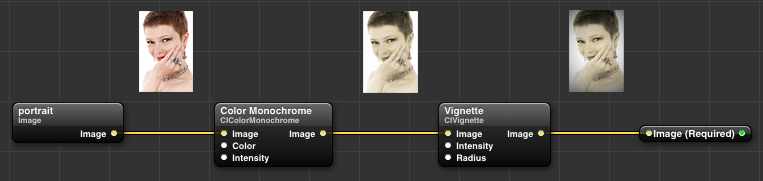
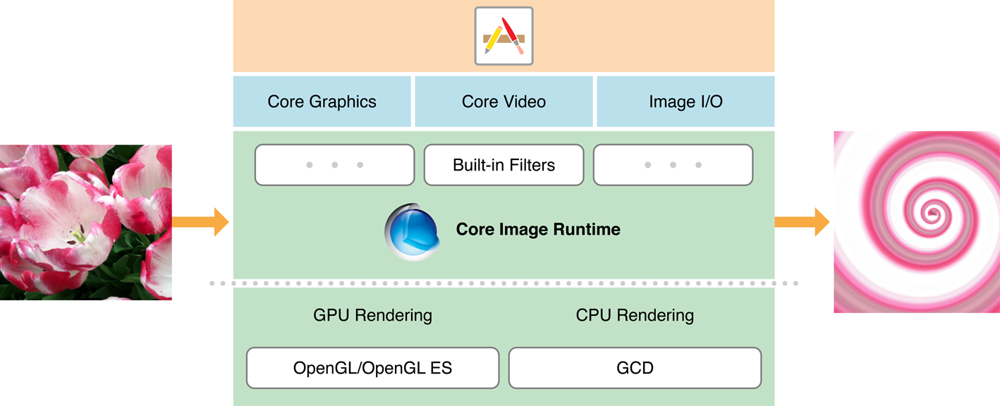

# Core Image + CI Filters

## Guidelines

- Fast image processing and analysis

- What to look at:

  Automatic Enhancements, CIDetector

  

## Ideas

- Program with which you can set all filters for your own photos and make face detection or object detection.
  - Small preview for each filter in the selection
- Quartz Composer

<figure>
  
  <figcaption>Fig: Quartz Composer example<br>
      Source: <a href="https://www.objc.io/images/issue-21/quartz_c4a7e45.png">https://www.objc.io/images/issue-21/quartz_c4a7e45.png</a></figcaption>
</figure>


## General

### Core Image

- Built-in Filters
- Feature detection
- Automatic image enhancement
- Chain multiple filters together 
- Highly hardware optimized image processing
- Near real-time performance for still and video images
- No need for understanding the details of OpenGL and Metal to use the technology.

### Different Image Classes

- UIImage
  - Class of the UIKit framework
  - High Level Way to display image data
  - Specified length and position in the "point" units
  - Mainly used to interact with the view
- Image
  - ToDo SwiftUI
- CIImage
  - Class of CoreImage framework.
  - Is not a picture itself but has all the information to create a picture
  - Is used to apply filters with Core Image
- CGImage
  - Class of CoreGraphics framework.
  - Can only represent bitmaps
  - Specifying the length and position in the "pixel" unit
  - Is used to apply blend modes and masking

### Context

- Core Image requires a Context in which the computing is done
- Allocates the necessary memory
- Compiling and running the filter kernels
- Very expensive to create

### Filter

- A filter creates a transformation of an image with set values

- The kernel is written in a subset of GLSL, the shading language of OpenGL (glslang)

  - A kernel is a convolution matrix or mask which can be applied to an image.

  - For example:

    ​    Identity:				  Edge detection:

    $\begin{bmatrix}0&0&0\\0&1&0\\0&0&0\end{bmatrix}$            $\begin{bmatrix}0&-1&0\\-1&4&-1\\0&-1&0\end{bmatrix}$

- Filters can be chained in a row, since the output of the first filter can become the input of the second.

  - Core Image combines chained filters intelligently so that they are calculated more efficiently.
  - Core image defers the work until the finished image is requested


## Processing Images

### Loading/saving Images

### Filtering an Image

1. Create and customize a filter chain
2. Pass an image to be filtered
3. Get the completely filtered image

<figure>
  
  <figcaption>Fig: Core Image pipeline<br>
      Source: <a href=https://developer.apple.com/library/archive/documentation/GraphicsImaging/Conceptual/CoreImaging/art/architecture_2x.png">https://developer.apple.com/library/archive/documentation/GraphicsImaging/Conceptual/CoreImaging/art/architecture_2x.png</a></figcaption>
</figure>

ToDo: Recreate that image or own example

#### Creating an input image

#### We need a CIImage and  for example it can be easily created with a UIImage.

```swift
let cgInputImage = CIImage(image: uiImageInput)
```

#### Passing the Image to the filter

```swift
sepiaFilter.setValue(cgInputImage, forKey: kCIInputImageKey)
```

#### Convert the resulting CIImage back to a UIImage

```swift
let uiOutputImage = UIImage(cgImage: cgOutputImage)
```


## Built-in Filters

### Display a list of all available filters

```swift
let buildInFilters = CIFilter.filterNames(inCategory: kCICategoryBuiltIn)
print(buildInFilters)
```

- 230 on iPadOS 15.1

### Initialize a CIFilter

```swift
let sepiaFilter = CIFilter(name: "CISepiaTone")
```

### Customize  Built-in Filters Parameters

- Most properties are accessible via a key-value coding (KVC)
- Display a list of all available input keys

```swift
let allSepiaInputKeys = sepiaFilter.inputKeys
print(allSepiaInputKeys)
```

- If you want to display more detailed information for each parameter, such as an explanation, the min/max/default value and more as follows:

```swift
let allSepiaAttributes = sepiaFilter.attributes
print(allSepiaAttributes)
```

- With the right key you can set a value as follows:

```swift
sepiaFilter.setValue(1.0, forKey: kCIInputIntensityKey)
```

- Unfortunately, the parameters are not type-safe and must therefore be set very carefully.


## Performance

ToDo: Testen

- When is cpu used?
- When is gpu used?
- Expenses to create a CIContext


- Whenever possible, Core Image will perform filtering on the GPU.
  - We can force Core Image to use the CPU with ``kCIContextUseSoftwareRenderer = true``
- In Xcode you can write diagnostic information for filtering to the console with the option CI_PRINT_TREE = 1 


## Detecting Faces/ Objects in an Image


## Auto Enhancing Images


## Creating Custom Filters


Core Graphics?


## 


## References

https://developer.apple.com

​	https://developer.apple.com/library/archive/documentation/GraphicsImaging/Reference/CIKernelLangRef/Introduction/Introduction.html

​	https://developer.apple.com/documentation/coreimage

​	https://developer.apple.com/library/archive/documentation/GraphicsImaging/Reference/CoreImageFilterReference/index.html#//apple_ref/doc/uid/TP40004346

​	https://developer.apple.com/documentation/coreimage/processing_an_image_using_built-in_filters

​	https://developer.apple.com/library/archive/documentation/GraphicsImaging/Conceptual/CoreImaging/ci_intro/ci_intro.html#//apple_ref/doc/uid/TP30001185

https://www.objc.io

​	https://www.objc.io/issues/21-camera-and-photos/core-image-intro/

https://titanwolf.org

​	https://titanwolf.org/Network/Articles/Article?AID=543f667d-673f-4fdd-9df9-9830126f8a71

​	https://titanwolf.org/Network/Articles/Article?AID=ffc1d7a3-f8bb-49bb-9644-580c716cad55

https://medium.com

​	https://medium.com/@ranleung/uiimage-vs-ciimage-vs-cgimage-3db9d8b83d94


